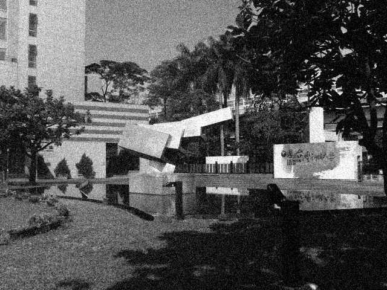
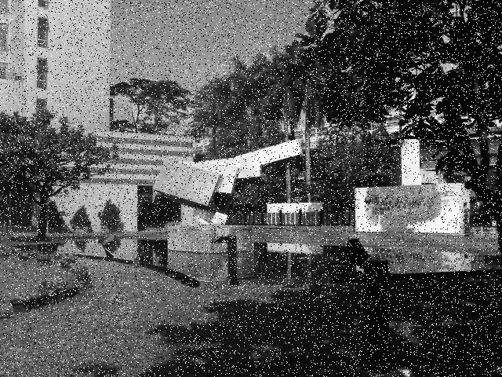
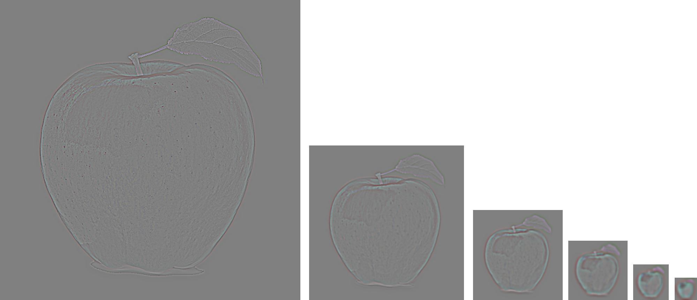
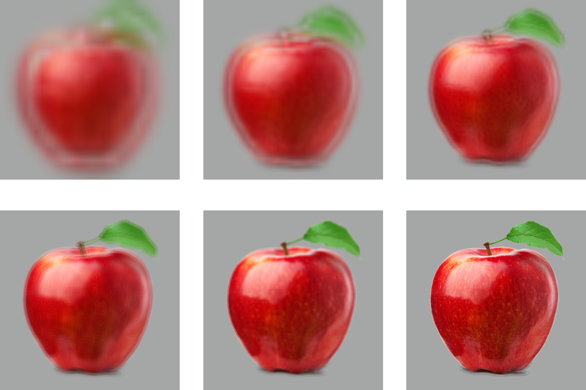
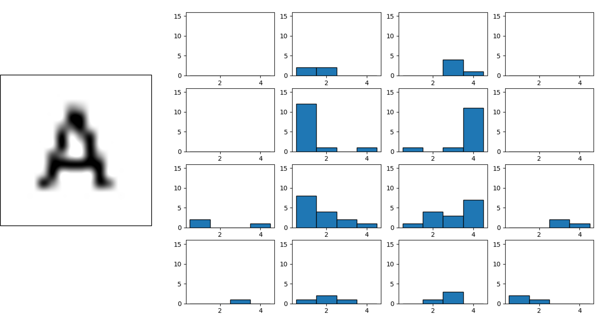
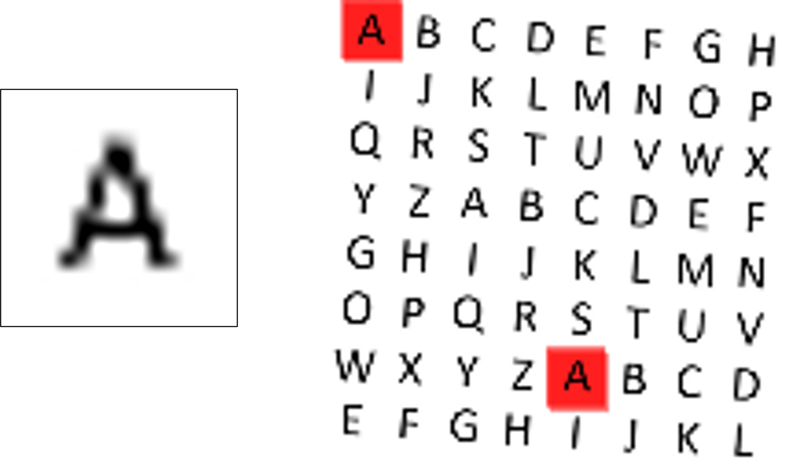
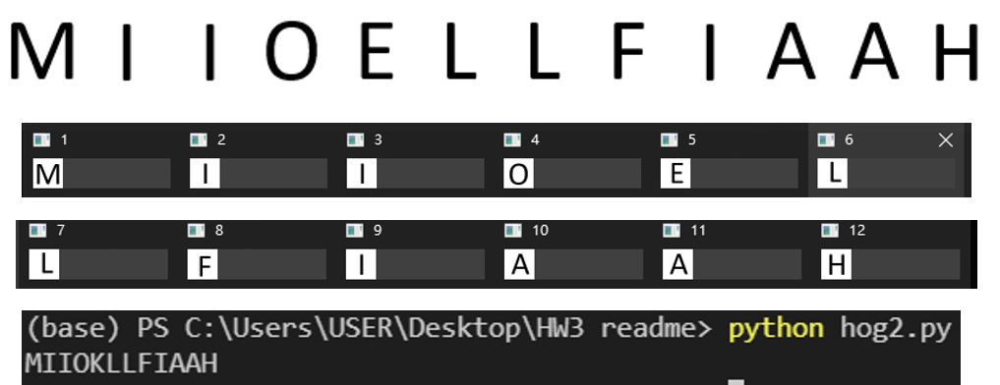

# ImageProcessing
simple  way to processing image and test some interesting things . Using pyton and numpy to implement some image processing algorithsm.

## Basic Spatial Filter

-  gaussian_noise

 

- mean filter 

 

     
- salt&pepper_noise

 

## Pyramid decomposition

- 殘差影像Residual image=材質資訊
- 將高斯模糊後原圖縮小二分之一(雙線性插值)後，再與放大至原圖同尺寸再相減就可以得到最底層的殘差影像。

     

將顏色資訊與材質資訊(殘差影像)，混合後還原出影像，以下是使用不同層級材質資訊還原出的結果，(中下)是用最細緻的材質資訊合成出來的結果，以肉眼來看與原圖(右下)幾乎沒有太大的差異，只有些許模糊。

     

## Simple HOG(Histogram of Oriented Gradient)
- 方向梯度直方圖，讀入灰階字母樣本，縮小至 16×16 像素尺寸，將影像分成 4×4 區域，每個區域有 16 (= 4×4)個像素。

     

- 讀取灰階測試影像。將影像縮小至 128×128 像素。用讀取測試影像不同位置的 ROI，並將相似度最高的前六名ROI區域顯示出來。

     

- 將字串影像二值化後，再對連通區域分離。由左至右切個成多個字母區塊。依序算出每個字母區域的 HOG 特徵向量，並跟第一個步驟 26 個字母的
HOG 特徵向量一一匹配，將 L2 距離最小的字母選出。

     

